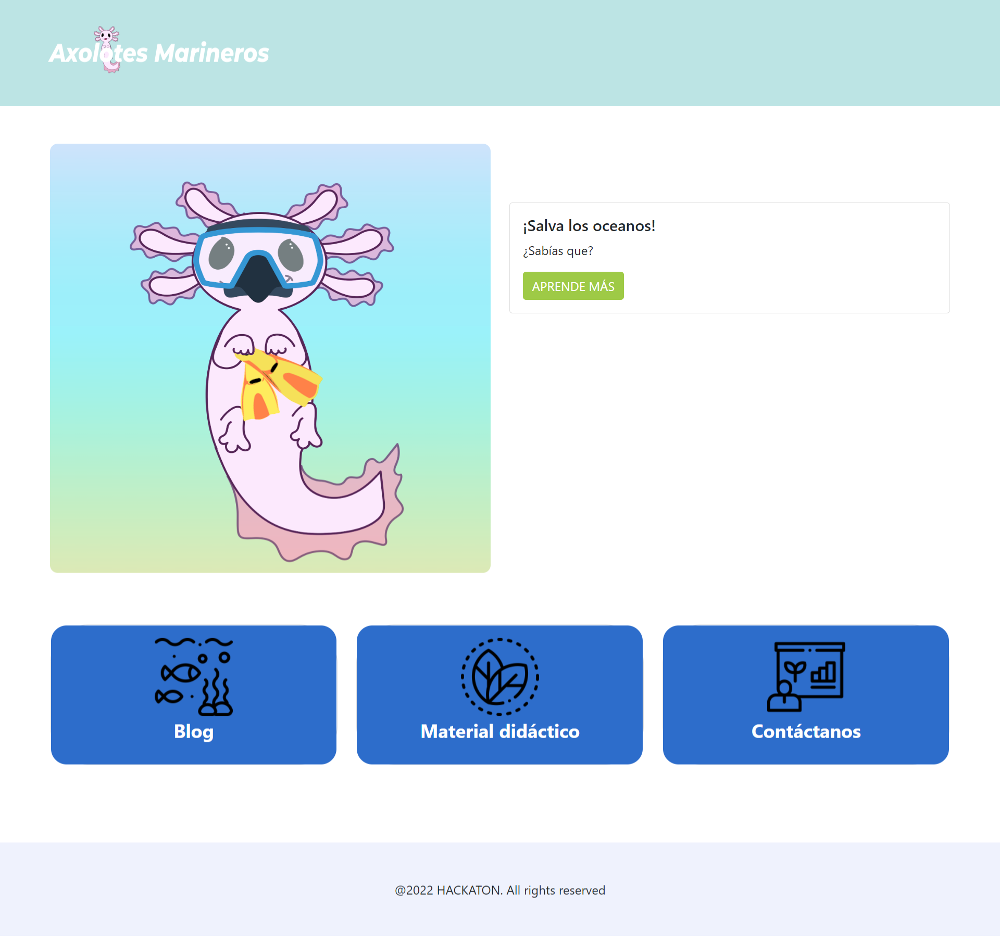
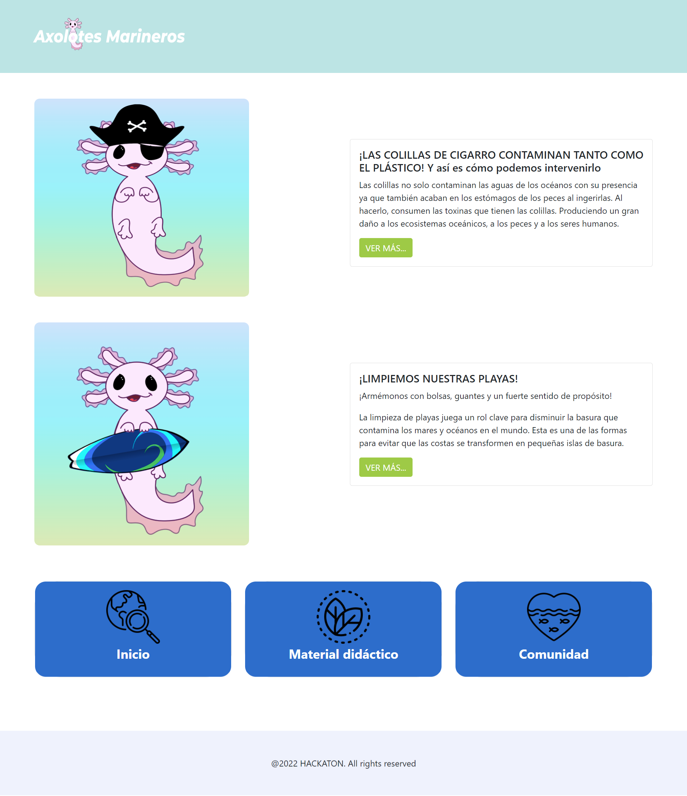
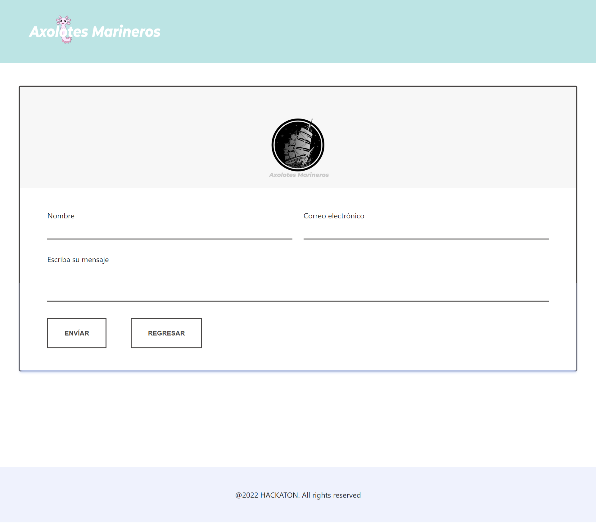

# AxolotesMarineros
Bienvenid@, tenga la confianza de revisar el contenido de esta propuesta realizada para ```Hack The Ocean```, "Hackatón" diseñado por ```Innovacción Virtual``` para el aprovechamiento de los conocimientos y habilidades desarrolladas durante el programa ``LaunchX``
***
## Índice
1. [¿Quiénes somos?](#quiénes-somos)
2. [Technologias](#technologias)
3. [Web Desplegada](#web-desplegada)
4. [Colaboradores](#colaboradores)
5. [Escalabilidad](#escalabilidad)
***
## ¿Quiénes somos?
¡Armémonos con bolsas, guantes y un fuerte sentido de propósito!
Axolotes Marineros es una propuesta que pretende llamar a la acción, enfocados a informar al público en general con un lenguaje no técnico, tenemos por objetivo generar una comunidad y promover la limpieza de playas y mares por medio de: 
* Blogs 
* Materiales y Recursos Didácticos
* Comunidad abierta, voluntaria e informativa 

***
## Tecnologías

Tecnologías empleadas para este proyecto:
* [HTML](https://html.com/): Version Global 
* [CSS](https://www.w3.org/Style/CSS/Overview.en.html): Version Global
* [Node.js](https://nodejs.org/es/): Version 18.1.0
* [Bootstrap](https://getbootstrap.com/docs/5.2/getting-started/introduction/): Version 5.1.3
***
## Web Desplegada

Enlace a Axolotes Marineros. 

[Ajolotes Marineros](https://antgtz.github.io/AxolotesMarineros/)

¿Quieres saber más? Visita nuestra video presentación en TikTok:
[Video De Presentación](https://www.tiktok.com/@branenberg/video/7098084848128052486?is_from_webapp=1&sender_device=pc&web_id=7098080646719899141)

Dejamos aquí algunas imagenes de nuestro proyecto:

**Index o página de inicio**


**Blog**


**Contáctanos**


***
## Colaboradores
***
**Angel** `` Programador Fronted``
> Redes: [GitHub](https://github.com/AngelDiaz-21) | [LinkedIn](https://www.linkedin.com/in/angel-alberto-diaz-cortes-76ab7722a/) | [Twitter](https://twitter.com/Angel86735180)
***
**Carlos** `` Cargo | Cargo``
> Redes: _@Arrobeo_ |
> [REDSOCIAL](ENLACE)
***
**Antonio** `` Programador Backend | Estructurar código``
> Redes: _@TranetRose_ |
> [Github](https://github.com/AntGtz)|
> [LinkedIn](https://www.linkedin.com/in/AntGtz/)
***
**Brandon Enrique Bernardino García Ramírez** `` Project Manager | Diseñador de Experiencias de Aprendizaje``
> Redes: _@Branenberg_ | [Lomography](https://www.lomography.com/homes/branenberg) |
> [LinkedIn](https://www.linkedin.com/in/branenberg/) | [Scholar Google](https://scholar.google.com/citations?user=QR9Q5PsAAAAJ&hl=es)

***
## Escalabilidad

A manera de objetivos a largo plazo mantenemos siempre:
1. **Promover la iniciativa de voluntariado desde cualquier "cuartel"**
_: confiamos en que cualquier iniciativa aporta, independientemente del contexto_
2. __Facilitar el acceso a la información, materiales, iniciativas y proyectos__ 
3. **Mantener un sentido de comunidad**
4. **Ser una extensión más para la llegada de la información**
_: consideramos que "todos los caminos llevan a Roma"_
